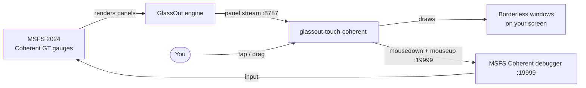

# glassout-touch-coherent

A small companion for [GlassOut](https://glassout.flyingart.dev/) that opens borderless,
position-locked pop-out windows for MSFS touchscreen avionics (WT G3000 GTCs and other touch
panels), sending input through the MSFS Coherent debugger so taps and drags register consistently.

GlassOut does the hard part — capturing cockpit panels live from the GPU with no FPS cost. This
tool reuses that stream and adds an input path tuned for WT G3000 touch-buttons, which respond to a
`mousedown`+`mouseup` on the gauge element. Taps and live drag/scroll both work.

It reads your existing GlassOut **profile** and places each panel exactly where the profile says.

> **Note:** A community workaround, not affiliated with or endorsed by GlassOut — all credit for the
> capture and streaming goes to GlassOut and its developer. This tool sends GTC input (taps and
> scrolling) through the MSFS Coherent debugger directly, to make it smoother; it's tested only on
> the Cirrus Vision Jet. GlassOut provides the video and must be running with a valid license. Touch
> input across the different GTC-equipped aircraft is an open problem — each plane's avionics respond
> differently, so there's no single fix — and GlassOut's developer is working on it
> ([Discord thread](https://discord.com/channels/956551149660540958/1499832594735435917/1538277215408619620)).
> Once GlassOut handles it natively, this tool won't be needed.

## How it works



- **Video** comes from GlassOut's engine (`ws://127.0.0.1:8787/ws`) — the same per-panel stream its
  own viewers use. Because the GlassOut app is running with your license, the engine sends
  **un-watermarked** frames to every client, including this one (GlassOut's "license borrowing") —
  no license key goes into this tool.
- **Input** goes to the MSFS Coherent GT debugger. A tap sends a `mousedown`+`mouseup` on the
  element under the point; a drag streams live `mousemove`s. Coherent allows one client per page and
  GlassOut's engine needs each page briefly to plant its capture marker — so this tool starts video
  first, waits until each panel is streaming, then takes the page for input.
- Placement follows your profile, converting GlassOut's scaled DIP coordinates to physical pixels so
  windows land correctly at any display scaling. Panels map to debugger pages by name
  (`wtg3000-gtc-2` ↔ `WTG3000_GTC_2`).

## Requirements

- Windows + **.NET 8 Desktop SDK** (`dotnet --list-runtimes` shows `Microsoft.WindowsDesktop.App 8.0.x`).
- **MSFS 2024** running, in a flight (the Coherent debugger on port 19999 is available by default).
- The **GlassOut app running and licensed, with none of its own pop-out windows open** — it runs the
  engine and lends its license, but must not be holding any debugger pages (see below). No NuGet packages.

## Run

**Before launching: the GlassOut app must be running** (for the engine and your license) **but with
none of its own pop-out windows open.** GlassOut and this tool can't both drive the same panel's
debugger page — any open GlassOut pop-out holds that panel's page and blocks this tool from taking
it for input.

```
git clone <repo-url>
cd glassout-touch-coherent
dotnet build
.\bin\Debug\net8.0-windows\glassout-touch.exe <profileName>
```

`<profileName>` is your GlassOut profile's name (from `%APPDATA%\GlassOut\profiles`), or a path to a
`.json`. Options: `--host`, `--glassout-port` (8787), `--cdp-port` (19999).

Run the built `.exe` directly, **not** `dotnet run` — `dotnet run` launches the app as a child
process and doesn't reliably forward `Ctrl+C` to it, so the app (and its windows) can be left
running. Started as the `.exe`, `Ctrl+C` terminates it cleanly. Only one instance runs at a time.

## Expected: a "Problems" warning in the GlassOut app

While this tool holds a GTC's debugger page, GlassOut's engine can't re-plant its marker on that
page, so the GlassOut app shows a **Problems / debug-port warning** (under the Discover page) for
those panels. **This is normal** — the panels keep streaming because the marker was planted before
this tool took the page. It clears when you close this tool.

## Troubleshooting

- **The console log shows a GTC as "view only" or "not streaming"** — GlassOut still has a pop-out
  window holding that panel's debugger page. **Close all of GlassOut's own pop-out windows**, then
  relaunch this tool.
- **Ctrl+C doesn't quit / a window lingers** — you ran it via `dotnet run`, which swallows Ctrl+C.
  Run the built `.exe` directly.
- **Windows land in the wrong spot** — the profile was saved on a different monitor layout (or a
  mixed-DPI edge case). Re-save the profile in GlassOut on your current setup; this tool follows it.
- **"No GlassOut engine on :8787"** — start the GlassOut app first.
